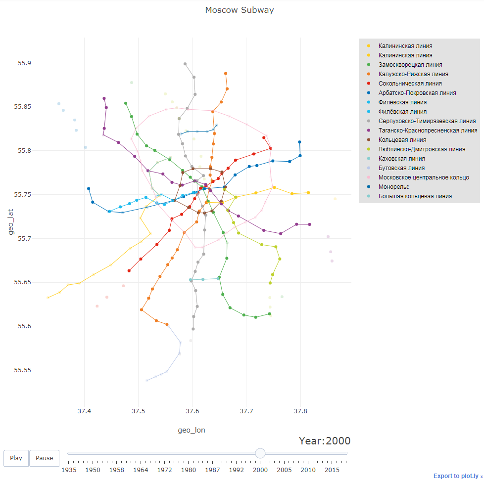

# Subway_animation

Отрисовка карты метро с учётом годов постройки станций - возможность переключаться между годами.

По умолчанию рисуется карта московского метрополитена. Решение переносится на произвольное метро при верном задании файла данных. 

